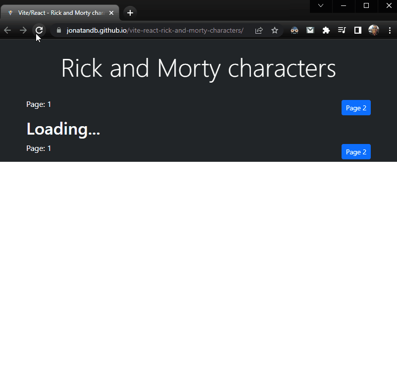

## Vite / React SPA: [Characters of Rick and Morty](https://jonatandb.github.io/vite-react-rick-and-morty-characters/)

---

## Available scripts:

- `npm run dev` to work on the development version of the project (Visit: http://localhost:3000)

- `npm run build` to build the production version of the project (Check `dist` folder)

- `npm run preview` to preview the project on the production version (\*Run after `npm run build`)

- `npm run deploy` to deploy the project to the production server (\*Run after `npm run build`) then visit: https://jonatandb.github.io/vite-react-rick-and-morty-characters/

---

## Researched sites:

- https://vitejs.dev/guide/static-deploy.html#github-pages
- https://getbootstrap.com
- https://vitejs.dev/guide/#scaffolding-your-first-vite-project
- https://vitejs.dev/
- [React y Rick and Morty REST API (con Vitejs y Github Pages)](https://www.youtube.com/watch?v=H1aNTRK3YfU&ab_channel=FaztCode)
